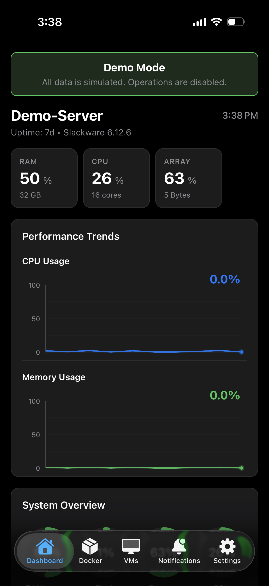
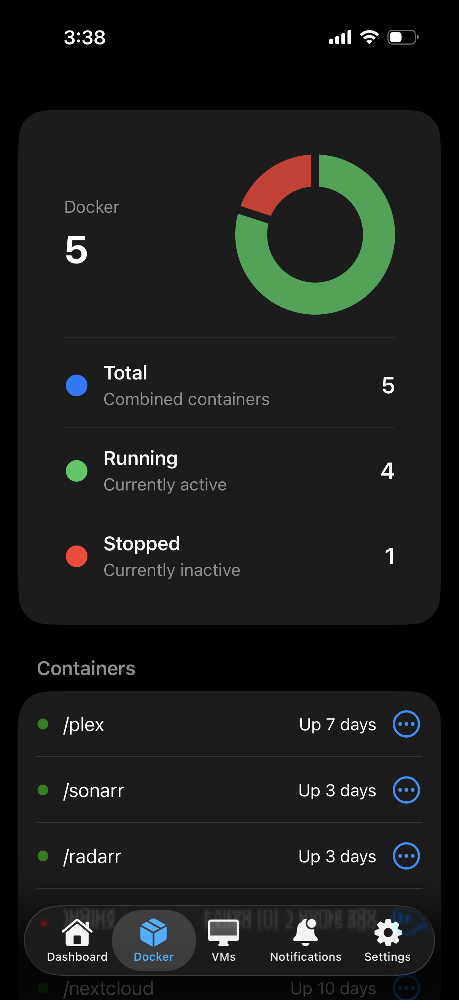
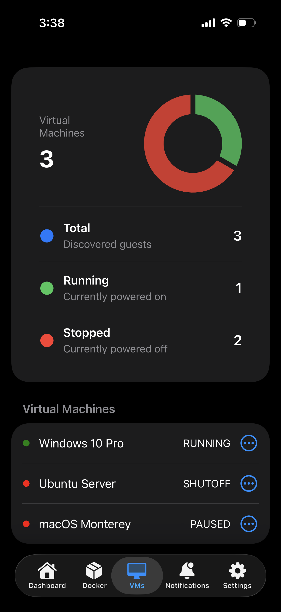
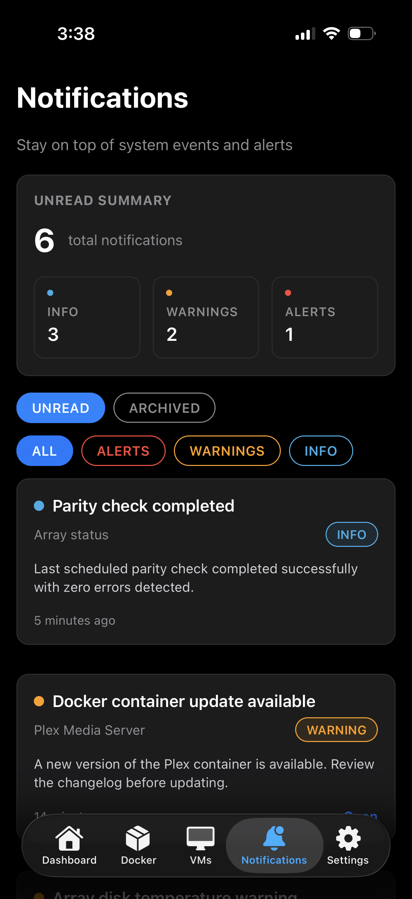
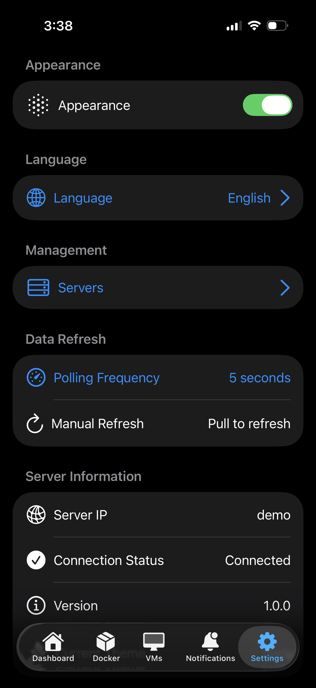

<div align="center">

# Parity: Unraid Client

**A modern, feature-rich mobile app for monitoring and managing your Unraid servers**

[](https://opensource.org/licenses/MIT)
[](https://expo.dev/)
[](https://reactnative.dev/)
[](https://www.typescriptlang.org/)

[Features](#features) • [Installation](#installation) • [Documentation](#documentation) • [Contributing](#contributing) • [Support](#support)

</div>

---

## Screenshots

<p align="center">
  
  
  
  
  
</p>

---

## Overview

**Parity** is an open-source, cross-platform mobile application that brings comprehensive Unraid server management to your iOS and Android devices. Built with React Native and Expo, it provides real-time monitoring, intuitive controls, and powerful notifications—all wrapped in a beautiful, native mobile interface.

### Why Parity?

While Unraid 7.2+ offers a responsive web interface, **Parity** delivers a superior mobile experience with:

- **Native Push Notifications** - Get instant alerts for critical events
- **Optimized Mobile UX** - Purpose-built for touch interfaces
- **Biometric Security** - Face ID/Touch ID support
- **Real-time Monitoring** - Live server metrics at your fingertips
- **Dark Mode** - Beautiful light and dark themes
- **Offline Support** - View cached data when disconnected
- **Multi-Server** - Manage multiple Unraid servers from one app

---

## Features

### Real-Time Monitoring
- **System Dashboard** - CPU, RAM, network, disk I/O, and temperatures
- **Array Status** - Disk health, parity status, and capacity monitoring
- **Smart Notifications** - Get alerted to issues before they become critical

### Docker Management
- View all containers with status and resource usage
- Start, stop, and restart containers
- Monitor container logs
- Quick access to container WebUIs

### Virtual Machine Control
- View VM status and resource allocation
- Start, stop, pause, and resume VMs
- Monitor VM resource usage

### Intelligent Notifications
- Critical alerts (disk failures, high temps, server offline)
- Warning notifications (high resource usage, container crashes)
- Configurable quiet hours
- Per-server notification settings

### Security & Privacy
- API key-based authentication
- Encrypted credential storage
- Biometric authentication support (Face ID, Touch ID, Fingerprint)
- No telemetry or data collection
- Local-only data storage

---

## Installation

### Prerequisites

- **Node.js** 18+ ([Download](https://nodejs.org/))
- **pnpm** (recommended) or npm/yarn
  ```bash
  npm install -g pnpm
  ```
- **Expo CLI**
  ```bash
  npm install -g expo-cli
  ```
- **Unraid Server** with OS v6.12+ (v7.2+ recommended)

### Setup

1. **Clone the repository**
   ```bash
   git clone https://github.com/yourusername/parity.git
   cd parity
   ```

2. **Install dependencies**
   ```bash
   pnpm install
   ```

3. **Start the development server**
   ```bash
   pnpm start
   ```

4. **Run on your device**
   - **iOS**: Press `i` or scan the QR code with the Camera app
   - **Android**: Press `a` or scan with the Expo Go app
   - **Web**: Press `w` to open in browser (limited functionality)

### Unraid Server Configuration

1. **Generate an API key on your Unraid server:**
   ```bash
   unraid-api apikey --create
   ```

2. **Save the API key** - You'll need it to connect the app

3. **Ensure the Unraid API is running:**
   ```bash
   systemctl status unraid-api
   ```

4. **Configure firewall** (if needed) to allow connections on port 3001

---

## Usage

### First-Time Setup

1. Launch the app
2. Enter your server details:
   - **Server Name**: A friendly name (e.g., "Home Server")
   - **Server IP/Hostname**: Your Unraid server address (e.g., `192.168.1.100:3001`)
   - **API Key**: The key generated in the previous step
3. Tap "Connect" to validate and save

### Dashboard

The main dashboard displays:
- System uptime and Unraid version
- Real-time CPU and RAM usage
- Network activity
- Array status
- Active containers and VMs

**Pull down to refresh** or enable **auto-refresh** in settings.

### Managing Servers

- Tap the server name in the header to switch between servers
- Add multiple servers in **Settings → Manage Servers**
- Remove or edit server configurations anytime

### Notifications

Configure notifications in **Settings → Notifications**:
- Choose which alert types to receive
- Set quiet hours for Do Not Disturb
- Customize notification sounds

---

## Architecture

Parity follows a clean, modular architecture:

```
src/
├── components/       # Reusable UI components
│   └── ui/          # Base design system components
├── config/          # App configuration
├── gql/             # GraphQL types and utilities
├── graphql/         # GraphQL queries and mutations
├── hooks/           # Custom React hooks
├── lib/             # Third-party integrations (Apollo Client)
├── providers/       # Context providers (Auth, Theme, Apollo)
├── screens/         # Screen components
├── services/        # Business logic layer
├── types/           # TypeScript type definitions
└── utils/           # Helper functions
```

### Key Technologies

- **React Native & Expo** - Cross-platform mobile framework
- **TypeScript** - Type-safe development
- **Apollo Client** - GraphQL data management
- **GraphQL Code Generator** - Auto-generate TypeScript types
- **AsyncStorage** - Secure local storage
- **Expo Router** - File-based navigation

---

## Documentation

- **[Product Requirements Document](docs/PRD.md)** - Complete product vision and specifications
- **[Architecture Guide](docs/ARCHITECTURE.md)** - Technical architecture deep-dive
- **[Contributing Guide](CONTRIBUTING.md)** - How to contribute to Parity
- **[API Reference](docs/API.md)** - Unraid GraphQL API integration
- **[Troubleshooting](docs/TROUBLESHOOTING.md)** - Common issues and solutions
- **[Changelog](CHANGELOG.md)** - Version history and updates

---

## Development

### Available Scripts

```bash
pnpm start          # Start Expo development server
pnpm android        # Run on Android device/emulator
pnpm ios            # Run on iOS simulator
pnpm web            # Run in web browser
pnpm lint           # Run ESLint
pnpm codegen        # Generate GraphQL TypeScript types
```

### GraphQL Code Generation

To generate TypeScript types from your Unraid GraphQL schema:

1. **Set environment variables:**
   ```bash
   export UNRAID_SCHEMA_URL=http://YOUR_IP:3001/graphql
   export API_KEY=your_api_key
   ```

2. **Run code generation:**
   ```bash
   pnpm codegen
   ```

### Testing

```bash
# Run unit tests (coming soon)
pnpm test

# Run integration tests (coming soon)
pnpm test:integration
```

---

## Building for Production

### iOS

```bash
# Build with EAS
eas build --platform ios

# Or build locally
pnpm ios --configuration Release
```

### Android

```bash
# Build APK with EAS
eas build --platform android

# Or build locally
pnpm android --variant=release
```

See the [Expo EAS Build documentation](https://docs.expo.dev/build/introduction/) for detailed instructions.

---

## Contributing

We welcome contributions from the community! Whether it's:

- Bug reports and fixes
- New features and enhancements
- Documentation improvements
- UI/UX refinements

Please read our [Contributing Guide](CONTRIBUTING.md) to get started.

### Quick Contribution Steps

1. **Fork the repository**
2. **Create a feature branch** (`git checkout -b feature/amazing-feature`)
3. **Commit your changes** (`git commit -m 'Add amazing feature'`)
4. **Push to the branch** (`git push origin feature/amazing-feature`)
5. **Open a Pull Request**

---

## License

This project is licensed under the **MIT License** - see the [LICENSE](LICENSE) file for details.

---

## Support & Community

### Get Help

- **[Documentation](docs/)**
- **[Issue Tracker](https://github.com/yourusername/parity/issues)**
- **[Discussions](https://github.com/yourusername/parity/discussions)**

### Connect with the Community

- **[Unraid Forums](https://forums.unraid.net/)**
- **Discord** (Coming soon)
- **[Twitter](https://x.com/spapinwar)**

### Reporting Issues

Found a bug? Have a feature request? Please [open an issue](https://github.com/yourusername/parity/issues/new) with:
- A clear, descriptive title
- Steps to reproduce (for bugs)
- Expected vs. actual behavior
- Screenshots (if applicable)
- Your environment (device, OS version, app version)

---

## Acknowledgments

**Powered by:**
- [Expo](https://expo.dev/) - React Native platform
- [Apollo Client](https://www.apollographql.com/) - GraphQL client
- [GraphQL Code Generator](https://the-guild.dev/graphql/codegen) - Type generation
- [Unraid API](https://github.com/unraid/api) - Official Unraid API

**Inspired by:**
- [unMobile](https://github.com/s3ppo/unraid_ui) by s3ppo
- The amazing Unraid community

---

## Roadmap

### Current Version (MVP)
- Real-time dashboard
- Docker container management
- VM control
- Multi-server support
- Push notifications
- Dark mode

### Upcoming Features
- Historical performance graphs
- Plugin management
- File browser (read-only)
- Multi-language support
- Apple Watch & Wear OS support
- Automation & scheduled actions

See our [full roadmap](docs/PRD.md#timeline--milestones) for more details.

---

## Star History

If you find Parity useful, please consider giving it a star on GitHub! It helps others discover the project.

[](https://star-history.com/#shreyaspapi/parity&Date)

---

<div align="center">

**Made with care for the Unraid Community**

[Back to Top](#parity-unraid-client)

</div>
